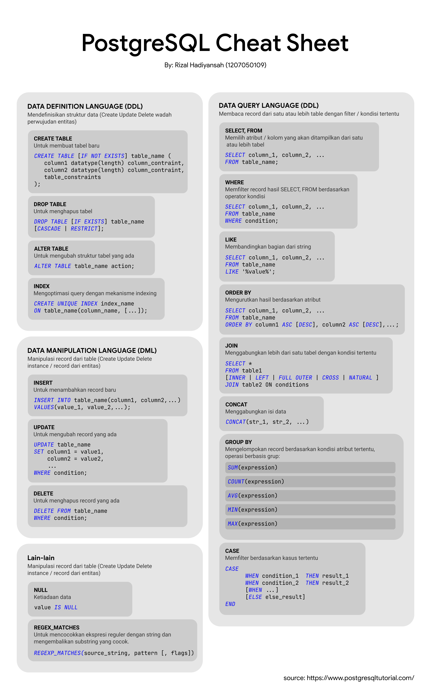

# IF214002

Repository pembelajaran Basis Data.

# Aplikasi Restoran

## Daftar Isi

- [IF214002](#if214002)
- [Aplikasi Restoran](#aplikasi-restoran)
  - [Daftar Isi](#daftar-isi)
  - [Deskripsi](#deskripsi)
  - [Changelog](#changelog)
    - [Pertemuan 1](#pertemuan-1)
    - [Pertemuan 2](#pertemuan-2)
    - [Pertemuan 3](#pertemuan-3)
    - [Pertemuan 4](#pertemuan-4)
    - [Pertemuan 5](#pertemuan-5)
    - [Pertemuan 6](#pertemuan-6)
    - [Pertemuan 7](#pertemuan-7)
    - [Pertemuan 8 (UTS)](#pertemuan-8-uts)
    - [Pertemuan 9](#pertemuan-9)
    - [Pertemuan 10](#pertemuan-10)
    - [Pertemuan 10](#pertemuan-10-1)
    - [Pertemuan 11](#pertemuan-11)
    - [Pertemuan 12](#pertemuan-12)
    - [Pertemuan 13](#pertemuan-13)
    - [Pertemuan 14](#pertemuan-14)
    - [Pertemuan 15](#pertemuan-15)
    - [Pertemuan 16](#pertemuan-16)
  - [Diagram](#diagram)
  - [Entitas dan Atribut](#entitas-dan-atribut)
    - [Users](#users)
    - [Roles](#roles)
    - [Stores](#stores)
    - [Postcodes](#postcodes)
    - [Items](#items)
    - [Item Categories](#item-categories)
    - [Item Category L10ns](#item-category-l10ns)
    - [Item Sub Categories](#item-sub-categories)
    - [Item Sub Category L10ns](#item-sub-category-l10ns)
    - [Item Addon Categories](#item-addon-categories)
    - [Item Addons](#item-addons)
    - [Orders](#orders)
    - [Order Details](#order-details)
    - [Order Detail Addons](#order-detail-addons)
    - [Tables](#tables)
    - [Coupons](#coupons)
    - [Coupon Users](#coupon-users)
    - [Coupon Stores](#coupon-stores)
  - [Relasi Entitas](#relasi-entitas)
  - [Profil](#profil)

## Deskripsi

Terkadang kita ingin pergi ke suatu restoran atau sedang kumpul bersama teman-teman dan ingin memesan makanan bersama
disana, apa yang
pertama di benak kita? Apakah tempatnya ramai? Apakah masih tersedia meja untuk dipesan? Aplikasi restoran ini menjawab
pertanyaan-pertanyaan tersebut. Dengan aplikasi restoran pelanggan dapat melihat status restoran yang ingin dipesan
apakah ramai pembeli, apakah meja masih tersedia, apakah makanan tersedia, dan sebagainya hanya melalui aplikasi.
Pelanggan hanya perlu memesan makanan dari aplikasi dan datang ke restoran untuk mengambil pesanan hanya dengan
menunjukkan kode QR unik, tanpa perlu repot
mengantri.

- Pencarian restoran terdekat dengan lokasi pelanggan.
- Melihat antrian dan status meja yang tersedia tanpa harus mengunjungi restoran terlebih dahulu.
- Mempermudah melakukan pemesanan makanan atau minuman secara langsung dari aplikasi, beserta varian yang tersedia (jika
  ada).
- Memesan secara terjadwal, pesan sekarang ambil beberapa jam kemudian.
- Mempermudah melihat daftar order, baik itu pesanan yang masih menunggu konfirmasi, dan sedang disiapkan; sampai
  pesanan yang sudah selesai, pesanan ditolak, dan pesanan dibatalkan.

## Changelog

_⚠️ Note :  
File gambar berekstensi .svg dengan tujuan agar file menjadi ringan dan tidak pecah. Untuk bisa memperbesar, klik kanan
pada gambar dan klik buka gambar di tab baru (open image in new tab)._

### [Pertemuan 1](pertemuan1)

- ⚡ Instalasi Diagrams.net
- ⚡ Instalasi Docker
- ⚡ Instalasi DBeaver
- 🆕 Membuat contoh diagram ERD

### [Pertemuan 2](pertemuan2)

- 🆕 Membuat rancangan aplikasi berupa deskripsi dan atribut yang dibutuhkan
- 🆕 Membuat diagram untuk rancangan aplikasi

<details>
  <summary>Diagram hasil praktikum (klik untuk membuka)</summary>


</details>

### [Pertemuan 3](pertemuan3)

- 🆕 Membuat rancangan aplikasi berupa diagram ER konseptual
- 🚀 Menambahkan cardinality dan optionality dari diagram sebelumnya

<details>
  <summary>Diagram hasil praktikum (klik untuk membuka)</summary>


</details>

### [Pertemuan 4](pertemuan4)

- 🚀 Menambahkan primary key dan composite key pada rancangan aplikasi
- 🚀 Menambahkan relasi antar entitas pada rancangan aplikasi
- 🚀 Mengubah diagram ER konseptual menjadi logical

<details>
  <summary>Diagram hasil praktikum (klik untuk membuka)</summary>


</details>

### [Pertemuan 5](pertemuan5)

- 🛠️ Memperbaiki beberapa optinality yang salah di beberapa entity
- ✨ Mengubah tema diagram agar terlihat lebih rapi
- ✨ Merapikan README.md
  - 🚀 Menambahkan changelog untuk setiap pertemuan
  - 🚀 Menambahkan gambar pertemuan sebelumnya untuk memudahkan perbandingan

<details>
  <summary>Diagram hasil praktikum (klik untuk membuka)</summary>


</details>

### [Pertemuan 6](pertemuan6)

- ✨ Mengganti tipe data dari `BINARY(16)` menjadi `UUID` agar lebih umum dan jelas
- ✨ Mengganti tipe data dari `TINYINT(1)` menjadi `BOOLEAN` agar lebih umum dan jelas
- 🆕 Menambahkan atribut `role` pada tabel `users`
- 🆕 Menambahkan tabel `roles`
- 🛠️ Menghapus atribut `last_updated` pada tabel `users`
- 🚀 Normalilasi Tabel! 🔥🔥🔥🔥
  - 🚀 Menghapus atribut `total_person` karena tidak diperlukan
  - 🚀 Memerdekakan kolom yang bergantung pada `postcode` menjadi tabel `postcodes`
- 🚀 Sinkronisasi README.md dengan diagram ER
- 🆕 Menambahkan file `restaurant.sql` yang berisi kode SQL untuk pembuatan tabel-tabel menggunakan MariaDB

<details>
  <summary>Diagram hasil praktikum (klik untuk membuka)</summary>


</details>

### [Pertemuan 7](pertemuan7)

Quiz 1 jam. Lihat [soal dan jawaban](pertemuan7).

<details>
  <summary>Diagram hasil praktikum (klik untuk membuka)</summary>


</details>

### Pertemuan 8 (UTS)
Lihat [soal dan jawaban UTS](uts).  
Lihat [soal dan jawaban UTS Praktikum](uts-praktikum).

### [Pertemuan 9](pertemuan9)
- 🛠️ Perbaikan struktur database pada users
- 🆕 Menambahkan file `restaurant.sql` yang berisi kode SQL untuk pembuatan tabel-tabel menggunakan PostgreSQL

<details>
  <summary>Diagram hasil praktikum (klik untuk membuka)</summary>


</details>

### [Pertemuan 10](pertemuan10)
- 🆕 Menambahkan query add data pada file `restaurant.sql`
- 🆕 Tugas

<details>
  <summary>Cheatsheet PostgreSQL (klik untuk membuka)</summary>


</details>

### [Pertemuan 10](pertemuan10)
- 🆕 Menambahkan query add data pada file `restaurant.sql`

### [Pertemuan 11](pertemuan11)
- 🆕 Menambahkan `restaurant-no-plpgsql.sql` yang berisi query tanpa PL/PGSQL
- 🚀 Update beberapa query `restaurant.sql`

### [Pertemuan 12](pertemuan12)
- 🆕 Menambahkan `restaurant-no-plpgsql-one-run.sql` yang berisi query siap run
- 🚀 Update beberapa query `restaurant-no-plpgsql.sql`

### [Pertemuan 13](pertemuan13)
- 🆕 Menambahkan project API di folder [dart_restaurant_api](dart_restaurant_api/)
- 🚀 Mengubah nama `restaurant-no-plpgsql-one-run.sql` menjadi `restaurant-template.sql`
- 🚀 Update beberapa query `restaurant-no-plpgsql.sql`

### [Pertemuan 14](pertemuan14)
- 🆕 Tugas, lihat [disini](pertemuan14)

### [Pertemuan 15](pertemuan15)
- 🆕 Penambahan query chart
- 🆕 Menambahkan project restaurant_store di folder [flutter_restaurant_store](flutter_restaurant_store/)

### [Pertemuan 16](pertemuan16)
- 🆕 Update API dengan penambahan middleware dengan JWT menggunakan Redis

## Diagram


## Entitas dan Atribut

_Note:_  
_\* primary key_  
_\*\* composite key_

### Users

- \* ID
- Full name
- Phone
- Language code
- Role
- Created at

### Roles

- \* Name

### Stores

- \* ID
- User ID
- Name
- Description
- Image
- Banner
- Phone
- Pickup type
- Street address
- Area
- Postcode
- Latitude
- Longitude
- Rating
- Is active

### Postcodes

- Postcode
- City
- State
- Country

### Items

- \* ID
- Store ID
- Category ID
- Sub category ID
- Name
- Picture
- Price
- Special offer
- Description
- Is active

### Item Categories
- \* ID
- Name

### Item Category L10ns
- \** Category ID
- \** Langauge Code
- Name

### Item Sub Categories
- \* ID
- Name

### Item Sub Category L10ns
- \** Sub Category ID
- \** Langauge Code
- Name

### Item Addon Categories
- \* ID
- \* Item ID
- Name
- Description
- Is multiple choice

### Item Addons
- \* ID
- Addon Category ID
- Name
- Price

### Orders
- \* ID
- User ID
- Store ID
- Table ID
- Coupon ID
- Buyer
- Store image
- Store banner
- Created at
- Coupon code
- Coupon name
- Discount
- Discount nominal
- Netto
- Brutto
- Status
  - Pending
  - Preparing
  - Ready
  - Complete
  - Cancelled
- Order type
  - Scheduled
  - Now
- Scheduled at
- Pickup type
  - Dine-in
  - Pickup
- Rating
- Comment

### Order Details
- \* ID
- Order ID
- Item ID
- Item name
- Quantity
- Price
- Netto
- Picture
- Item detail

### Order Detail Addons
- \* ID
- Order detail ID
- Addon ID
- Addon name
- Quantity
- Price

### Tables
- \* ID
- Store ID
- Name
- Max person
- Book price

### Coupons
- \* ID
- Inserted by
- \** Coupon code
- Name
- Description
- Expiry date
- Discount type
  - Fixed
  - Percentage
- Discount
- Min total
- Max discount
- Max number use total
- Max number use user
- Created at
- All store
- \** Is valid

### Coupon Users
- \** Coupon ID
- \** User ID

### Coupon Stores
- \** Coupon ID
- \** Store ID

## Relasi Entitas

|       Entitas 1       |  Relasi   |        Entitas 2        |
| :-------------------: | :-------: | :---------------------: |
|         Users         | 1 1 - 0 1 |         Stores          |
|         Users         | 1 1 - 0 N |      Coupon Users       |
|         Users         | 1 1 - 0 N |         Coupons         |
|         Users         | 1 1 - 0 N |         Orders          |
|        Stores         | 1 1 - 0 N |         Orders          |
|        Stores         | 1 1 - 0 N |         Tables          |
|        Stores         | 1 1 - 0 N |          Items          |
|       Postcodes       | 1 1 - 0 N |         Stores          |
|         Items         | 1 1 - 0 N |      Order Details      |
|         Items         | N 0 - 1 1 |     Item Categories     |
|         Items         | N 0 - 0 1 |   Item Sub Categories   |
|         Items         | N 0 - 1 1 |  Item Addon Categories  |
|    Item Categories    | 1 1 - 0 N |   Item Category L10ns   |
|  Item Sub Categories  | 1 1 - 0 N | Item Sub Category L10ns |
| Item Addon Categories | 1 1 - 0 N |       Item Addons       |
|      Item Addons      | 1 1 - 0 N |   Order Detail Addons   |
|     Order Details     | 1 1 - 0 N |  Order Details Addons   |
|        Tables         | 1 1 - 0 N |         Orders          |
|        Orders         | 1 1 - 0 N |      Order Details      |
|        Orders         | N 0 - 0 1 |         Coupons         |
|        Coupons        | 1 1 - 0 N |      Coupon Stores      |
|        Coupons        | 1 1 - 0 N |      Coupon Users       |

## Profil

```
Nama        : Rizal Hadiyansah  
NIM         : 1207050109  
Kelas       : IF E  
Universitas : UIN Sunan Gunung Djati
```