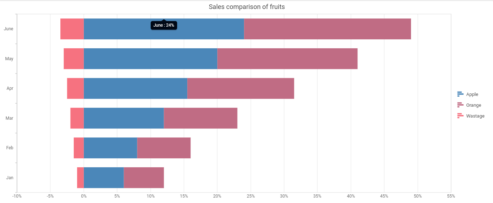

# Tugas
1. Sebagai pemimpin organisasi / perusahaan, dari data hasil aplikasi yang sudah dibuat, tentukan masalah-masalah prioritas untuk dicari solusinya !
2. Tentukan struktur data dan bentuk visualisasinya ! Ada contoh visualisasinya (screenshot)
3. Buat query SQL untuk mendapatkan data no. 2 tersebut !

# Jawaban
## Masalah prioritas
- Ingin mengetahui item yang sering dipesan di satu restoran per minggu / bulan
- Ingin mengetahui trend pemasukan di satu restoran per minggu / bulan
- Ingin mengetahui trend rating 
## Struktur data dan bentuk visualisasi
- Trend pemesanan item
    - Visualisasi: Stack Bar Chart
    - Data: minggu ke, bulan, tahun, jumlah pemesanan
    - Screenshot: 
## Query SQL
- Trend pemesanan item
```sql
SELECT DATE_TRUNC('day', orders.created_at) AS date,
    items.id,
    items.name,
    items.price,
    SUM(order_details.quantity) AS total_sales
FROM items,
    order_details,
    orders
WHERE items.id = order_details.item_id
    AND order_details.order_id = orders.id -- AND orders.status = 'complete'
    AND orders.store_id = '93ab578c-46fa-42f6-b61f-ef13fe13045d'
    AND orders.created_at >= NOW() - INTERVAL '7 days'
GROUP BY date,
    items.id
ORDER BY total_sales DESC;
```